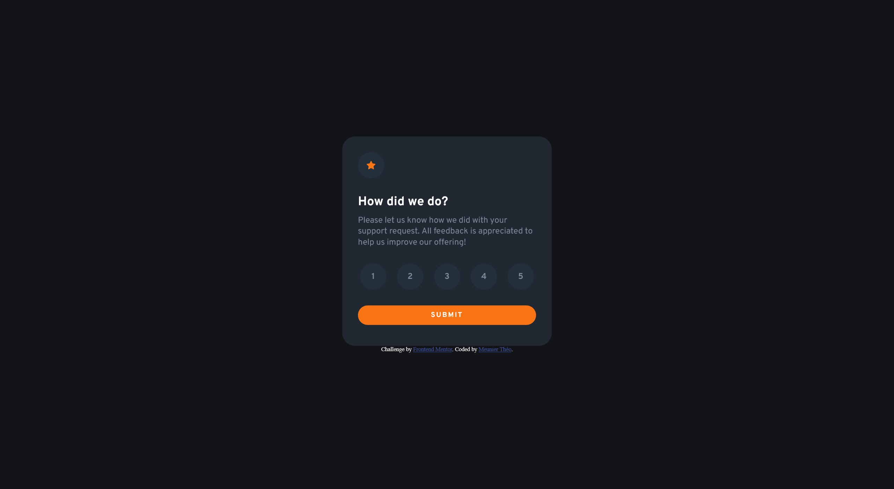

# Frontend Mentor - Interactive rating component solution

This is a solution to the [Interactive rating component challenge on Frontend Mentor](https://www.frontendmentor.io/challenges/interactive-rating-component-koxpeBUmI). Frontend Mentor challenges help you improve your coding skills by building realistic projects. 

## Table of contents

- [Overview](#overview)
  - [The challenge](#the-challenge)
  - [Screenshot](#screenshot)
  - [Links](#links)
- [My process](#my-process)
  - [Built with](#built-with)
  - [Useful resources](#useful-resources)
- [Author](#author)

## Overview

### The challenge

Users should be able to:

- View the optimal layout for the app depending on their device's screen size
- See hover states for all interactive elements on the page
- Select and submit a number rating
- See the "Thank you" card state after submitting a rating

### Screenshot

### Links

- Solution URL: [Add solution URL here](https://your-solution-url.com)

## My process

### Built with

- CSS custom properties
- Flexbox
- [Less](https://lesscss.org/) - CSS preprocessor

### Useful resources

- [CSS documentation](https://developer.mozilla.org/en-US/docs/Web/CSS) - I feel like you can find all what you need here.
- [HTML documentation](https://developer.mozilla.org/en-US/docs/Web/HTML)

## Author

- Frontend Mentor - [@Theo77-art](https://www.frontendmentor.io/profile/Theo77-art)
- Twitter - [@theo_tatsuki](https://twitter.com/theo_tatsuki)

